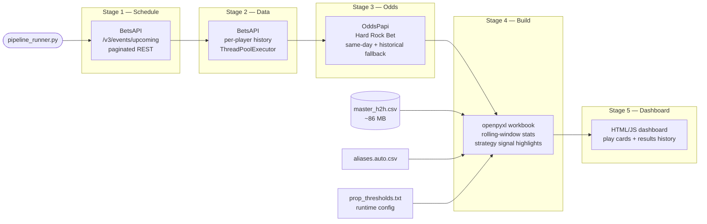

# table-tennis-analytics
# ttMaster — Table Tennis H2H Analytics Pipeline

> A production-grade daily data pipeline that collects match schedules, fetches historical head-to-head records, sources opening odds from two independent bookmaker APIs, and delivers formatted Excel workbooks, a live web dashboard, and automated Discord alerts for four professional table tennis leagues.

---

## What It Does

Every day, ttMaster runs a fully automated five-stage pipeline:

1. Fetches the next day's match schedule via BetsAPI REST
2. Pulls each scheduled player's full H2H match history (concurrently) from BetsAPI
3. Sources Hard Rock Bet opening odds via OddsPapi, with fallback to BetsAPI odds
4. Builds structured Excel workbooks with rolling-window statistics and strategy signal highlights
5. Generates a live HTML dashboard with time-triggered play reveals and a graded results history

The end result is a daily analytical workbook used for real betting decisions across four leagues — Poland TT Elite Series, Czech Liga Pro, International TT Cup, and Setka Cup.

---

## Pipeline Architecture



---

## Key Features

### Data Collection
- **Dual-source odds pipeline** — OddsPapi (Hard Rock Bet) is preferred; BetsAPI fills gaps. Odds older than 30 days are excluded to prevent stale line contamination.
- **Automated odds orientation check** — Detects and corrects reversed player assignments when a bookmaker's "favorite" wins fewer than 40% of historical H2H meetings.
- **Concurrent history fetching** — `ThreadPoolExecutor` parallelizes per-player BetsAPI calls; a local JSON cache prevents redundant requests on reruns.
- **Name normalization** — Fuzzy alias resolution (`suggest_aliases.py`) maps name variants across data sources to canonical identities in the master database.
- **Deduplication by signature** — Every match record carries a stable `sig` key (`date|league|A|B|sets|scores_canonical`) used across ingestion, backfill, and workbook build stages.

### Analytics & Workbook Build
- **Rolling-window statistics** — L10, L15, L20, L25, L30, L40 windows computed with strict no-lookahead methodology (only prior matches visible at each point in time).
- **Six prop types** — SPLIT, S2 UP 1-0, S3 UP 2-0, S4 UP 2-1, S1 -2.5, SET -2.5, O74.5/U74.5, and S5 WIN, each with backtest-derived thresholds.
- **Four-tier color highlighting** — RED (60–64.9%), YELLOW (65–69.9%), GREEN (70–79.9%), PURPLE (80%+) applied per-cell based on runtime-loaded threshold files.
- **Prop Form column** — Shows the last 5 applicable outcomes per prop row (e.g., `W-L-W-W-W`) for quick recency assessment.
- **Recency adjustment** — A second threshold file (`prop_thresholds_updated.txt`) carries backtest-derived recency overrides that the build script applies automatically, no code change required.
- **Moneyline Trends tab** — Appended into the combined workbook; shows H2H streak analysis, opening decimal/US odds with source indicators (`✓` for Hard Rock Bet lines).
- **Window age annotations** — DATA strings include `(Xd)` span indicators so the calendar age of each rolling window is immediately visible.

### Post-Processing
- **`grade_sheet_results.py`** — Looks up actual match outcomes in `master_h2h.csv` and writes WIN/LOSS/PUSH/NO MATCH results back into the workbook with color-coded RESULT cells. Produces SUMMARY and SUMMARY PER PROP tables with live Excel COUNTIFS dropdowns.
- **`combine_sheets.py`** — Smart-merges two daily workbooks: deduplicates by player pair + time, keeps the newer version of conflicting rows, appends early-morning matches only in the older file. Sorted by match time.
- **`batch_process_days.py`** — Chains combine → backfill → grade for a range of dates in one command; skips already-completed steps unless `--force` is passed.
- **`make_subscriber_workbook.py`** — Produces a subscriber-safe export: strips long-window stats from DATA columns, removes internal-only rows, and optionally converts to PDF via Excel COM.

### Dashboard
- **`dashboard/index.html`** — Today's play cards, each with a JS countdown that reveals full details 5 minutes before match time. Uses the same GREEN/PURPLE STAT + TIME-highlight selection rules as the Discord poster.
- **`dashboard/results.html`** — Rolling W/L/P record across all time, plus a day-by-day breakdown sourced from every graded sheet in the archive.

### Discord Integration
- **`discord_poster.py`** — Posts highlighted plays to Discord via webhook. Filters to GREEN/PURPLE STAT cells that also have a manually highlighted TIME cell. Groups plays from the same match into one message by default. Tracks posted signatures in `sent.json` to prevent double-posts. Handles Discord 429 rate-limit responses automatically.

### Backtesting
- **`backtest_h2h.py`** — Pair-specific backtester using rolling windows from only prior meetings between each exact A vs B pair. No-lookahead, no per-player contamination.
- **`backtest_h2h_recency.py`** — Same methodology, additionally stratified by the calendar span of each rolling window — distinguishes tightly-clustered recent windows from spread-out historical ones.
- **`analyze_backtest_recency.py`** / **`generate_updated_thresholds.py`** — Post-process backtest output into human-readable threshold reports and generate the runtime `prop_thresholds_updated.txt` override file.

---

## Tech Stack

| Layer | Tools |
|-------|-------|
| Language | Python 3.11+ |
| HTTP / APIs | `requests`, `urllib` (BetsAPI REST, OddsPapi REST) |
| Concurrency | `concurrent.futures.ThreadPoolExecutor` |
| Workbook generation | `openpyxl` |
| Dashboard | Vanilla HTML / CSS / JavaScript (no framework) |
| Notifications | Discord Webhooks |
| Data storage | CSV (`master_h2h.csv`, ~86 MB), flat-file JSON cache |
| Name matching | `difflib.get_close_matches` (fuzzy alias resolution) |
| Scheduling | Windows Task Scheduler / cron |

---

## Data Model

**`master_h2h.csv`** is the core database — every historical match, deduplicated, in a single flat file.

```
date | match_time_et | league | A | B | setsA | setsB | set_scores
total_sets | total_pts_A | total_pts_B | source | ingested_at | sig
```

- Players A and B are always stored in **alphabetical order**, making all rolling window computations deterministic regardless of how a match was originally recorded.
- `sig` is the deduplication key: `date|league|A|B|sets|scores_canonical` — used consistently across the ingestion pipeline, backfill scripts, and workbook builder.
- The database is append-only. `backfill_master_from_sheet.py` handles retroactive ingestion when results weren't captured in real time.

---

## Scale & Scope

| Metric | Value |
|--------|-------|
| Historical match database | ~86 MB, 100k+ records |
| Leagues covered | 4 (Elite, Czech, TT Cup, Setka) |
| Prop types computed | 8 |
| Rolling window sizes | L10 / L15 / L20 / L25 / L30 / L40 |
| Odds sources | 2 (BetsAPI, OddsPapi / Hard Rock Bet) |
| Pipeline stages | 5 |
| Daily runtime | ~3–8 min depending on schedule size |

---

## Output Sample

Each daily workbook contains:

- **Schedule sheet** — One row per prop per matchup. Columns include player names + opening odds (with source indicator), stat window, raw DATA string, percentage, color-tier highlight, and PROP FORM (last 5 outcomes).
- **Top Picks 2 sheet** — Filtered view of only the highest-confidence signals.
- **H2H Data sheet** — Raw rolling-window stats for every scheduled pair.
- **Moneyline Trends tab** — Streak analysis with decimal and US odds, source-flagged.

Graded workbooks add RESULT, MATCH, and NOTE columns plus SUMMARY and SUMMARY PER PROP tables at the bottom of the Schedule sheet.

---

## Repository Structure

This is the **private working repository**. See commit history for a full development log.
The pipeline has been in active daily use since early 2026, with continuous improvements to signal methodology, odds sourcing, and output formatting.

---

## Development Highlights

A few notable engineering decisions made during active development:

- **Removed browser automation entirely** — The schedule stage was originally built on Playwright/headless Chromium scraping Scores24's GraphQL endpoint. It was later replaced with direct BetsAPI REST calls, eliminating a significant reliability dependency and reducing Stage 1 runtime from ~45s to under 2s.
- **Odds orientation problem** — BetsAPI and OddsPapi both assign player positions to a fixture independently of each other and without exposing names in the odds objects. Solved by cross-referencing opening lines against H2H win rates: if the assigned "favorite" wins fewer than 40% of historical meetings, the odds are automatically flipped.
- **Runtime threshold configuration** — Prop color-tier thresholds were originally hardcoded in the build script. They're now loaded from flat config files at startup, making it possible to update signal rules (and deploy recency adjustments from the backtester) without modifying or redeploying any code.
- **No-lookahead backtesting** — Every backtest computes rolling windows the same way the live pipeline does: only matches prior to the evaluation point are visible. Per-player windows were explicitly rejected in favor of pair-specific windows to avoid cross-match contamination.
