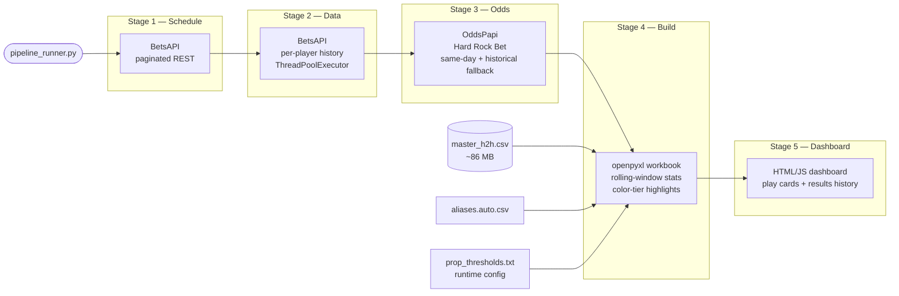

# ttMaster — Table Tennis H2H Analytics Pipeline

> A production-grade daily data pipeline that collects match schedules, fetches historical head-to-head records, sources opening odds from two independent bookmaker APIs, and delivers formatted Excel workbooks, a live web dashboard, and automated Discord alerts — for four professional table tennis leagues.

In active development since **April 2025**. Change log below reflects tracked commits from April 2026 onward.

---

## Table of Contents

1. [What It Does](#what-it-does)
2. [Pipeline Architecture](#pipeline-architecture)
3. [Key Features](#key-features)
4. [Tech Stack](#tech-stack)
5. [Data Model](#data-model)
6. [Scale & Scope](#scale--scope)
7. [Sample Output](#sample-output)
8. [Development Highlights](#development-highlights)
9. [Change Log](#change-log)
10. [Source Code](#source-code)

---

## What It Does

ttMaster runs a fully automated five-stage pipeline each day. It collects the next day's match schedule, pulls each player's complete head-to-head match history, and fetches opening betting lines from two independent bookmaker APIs. That data feeds a statistical engine that computes rolling-window win rates across multiple bet types for every scheduled matchup — each one color-coded by historical confidence so the strongest plays are immediately visible without manually sifting through hundreds of rows.

The final outputs are a formatted Excel workbook, a live web dashboard where play cards reveal themselves before each match, and automated Discord posts for the highest-confidence signals — covering four leagues: **Poland TT Elite Series, Czech Liga Pro, International TT Cup, and Setka Cup**.

---

## Pipeline Architecture



---

## Key Features

### Data Collection

- **Dual-source odds pipeline** — OddsPapi (Hard Rock Bet) is the preferred odds source; BetsAPI fills any gaps. Opening lines older than 30 days are automatically excluded to prevent stale data from influencing signals.
- **Automated odds orientation correction** — Both APIs assign players to a fixture independently, without exposing names inside the odds objects. The pipeline cross-references assigned lines against historical win rates and automatically flips reversed assignments.
- **Concurrent history fetching** — `ThreadPoolExecutor` parallelizes per-player API calls; a local JSON cache prevents redundant network requests on reruns.
- **Player name normalization** — Player names vary across data sources. A fuzzy-match alias system maps name variants to canonical identities in the master database, with a review tool (`suggest_aliases.py`) that surfaces unresolved conflicts.
- **Deduplication by signature** — Every match record carries a stable `sig` key (`date|league|A|B|sets|scores_canonical`) used consistently across ingestion, backfill, and workbook build stages to prevent duplicates regardless of source.

### Analytics & Workbook Build

- **Rolling-window statistics** — L10, L15, L20, L25, L30, and L40 windows computed with strict no-lookahead methodology: only matches prior to each evaluation point are visible, matching how the pipeline would have performed historically.
- **Multiple bet types per matchup** — Each matchup is analyzed across several categories:
  - *Momentum props* — Does an early-set lead hold? (e.g., does the player who wins Set 1 go on to win Set 2?)
  - *Deciding-set props* — How often does a matchup go to a full 5-set deciding match?
  - *Scoring margin props* — Do players tend to win sets by large or small margins?
  - *Total points props* — Does a matchup tend to run over or under a total points line?
- **Four-tier color highlighting based on historical win rate** — RED (60–64.9%), YELLOW (65–69.9%), GREEN (70–79.9%), PURPLE (80%+). Thresholds are loaded from a runtime config file, so signal rules can be updated without touching the build script.
- **Prop Form column** — Shows the last 5 real outcomes for each signal row (e.g., `W-L-W-W-W`), giving a quick at-a-glance view of recent trend consistency.
- **Window age display** — Each stat row shows how old its data window is (e.g., 45 days for an L20 window), making it easy to distinguish tightly clustered recent data from a window spread across years.
- **Recency-adjusted thresholds** — A second config file holds backtest-derived overrides that adjust color-tier cutoffs based on how predictive tightly-clustered vs. spread-out windows have been historically. Regenerated from the backtester and deployed with no code change.
- **Moneyline Trends tab** — Appended to the combined workbook; shows H2H streak analysis with opening decimal and US odds, source-flagged with `✓` when the line came from Hard Rock Bet.

### Results & Grading

- **`grade_sheet_results.py`** — After a match day completes, looks up actual outcomes in the master database and writes WIN/LOSS/PUSH/NO MATCH results back into each row of the workbook. Generates filterable SUMMARY tables broken down by signal tier and by individual bet type, making it easy to analyze performance any way you want.
- **`combine_sheets.py`** — Smart-merges two daily workbooks: deduplicates by player pair and match time, keeps the newer version of conflicting rows, and re-sorts by start time. Handles the common case where early-morning matches appear in one run but not the other.
- **`batch_process_days.py`** — Chains combine → backfill → grade for a range of dates in a single command. Skips already-completed steps; `--force` re-runs everything.
- **`make_subscriber_workbook.py`** — Produces a cleaned export for subscribers: strips internal long-window stat details, removes certain internal-only rows, and optionally exports to PDF.

### Dashboard

- **`dashboard/index.html`** — Today's play cards. Each card is hidden behind a JS countdown and reveals itself 5 minutes before match time — uses the same signal selection rules as the Discord poster (GREEN and PURPLE highlights only, with a manually flagged time cell).
- **`dashboard/results.html`** — Rolling win/loss/push record across all time, plus a day-by-day breakdown pulled from every graded workbook in the archive.

### Discord Integration

- **`discord_poster.py`** — Posts the day's highest-confidence plays to Discord via webhook. Only GREEN and PURPLE signals with a manually flagged match time are posted. Plays from the same match are grouped into a single message by default. A local `sent.json` file prevents double-posts on reruns. Handles Discord 429 rate-limit responses automatically with retry backoff.

### Backtesting

- **`backtest_h2h.py`** — Pair-specific backtester: for each A vs B pair, tests all signal types using rolling windows built from only prior meetings between those two players. Strict no-lookahead, no cross-match contamination.
- **`backtest_h2h_recency.py`** — Same methodology, additionally stratified by how many calendar days each rolling window spans — distinguishes tightly-clustered recent matches from the same window spread across years.
- **`analyze_backtest_recency.py`** / **`generate_updated_thresholds.py`** — Post-process backtest output into readable threshold reports and generate the runtime override config used by the build script.

---

## Tech Stack

| Layer | Tools |
|-------|-------|
| Language | Python 3.11+ |
| HTTP / APIs | `requests`, `urllib` — BetsAPI REST, OddsPapi REST |
| Concurrency | `concurrent.futures.ThreadPoolExecutor` |
| Workbook generation | `openpyxl` |
| Dashboard | Vanilla HTML / CSS / JavaScript |
| Notifications | Discord Webhooks |
| Data storage | Flat-file CSV (~86 MB), local JSON cache |
| Name matching | `difflib.get_close_matches` (fuzzy alias resolution) |

---

## Data Model

**`master_h2h.csv`** is the core database — every historical match, deduplicated, in a single flat file.

```
date | match_time_et | league | A | B | setsA | setsB | set_scores
total_sets | total_pts_A | total_pts_B | source | ingested_at | sig
```

- Players A and B are always stored in **alphabetical order**, making all rolling window computations deterministic regardless of how a match was originally recorded.
- `sig` is the deduplication key (`date|league|A|B|sets|scores_canonical`) — used consistently across the ingestion pipeline, backfill scripts, and workbook builder.
- The database is append-only. `backfill_master_from_sheet.py` handles retroactive ingestion when results weren't captured in real time.

---

## Scale & Scope

| Metric | Value |
|--------|-------|
| Historical match database | ~86 MB, 100k+ records |
| Leagues covered | 4 |
| Bet types analyzed per matchup | 8 |
| Rolling window sizes | L10 / L15 / L20 / L25 / L30 / L40 |
| Odds sources | 2 (BetsAPI, OddsPapi / Hard Rock Bet) |
| Pipeline stages | 5 |
| Daily runtime | ~3–8 minutes depending on schedule size |
| In development since | April 2025 |

---

## Sample Output

Each daily workbook contains:

- **Schedule sheet** — One row per signal per matchup. Columns include player names with opening odds (source-flagged), the stat window, supporting data, historical win rate, color-tier highlight, and a PROP FORM column showing the last 5 real outcomes.
- **H2H Data sheet** — Full rolling-window stat tables for every scheduled pair.
- **Moneyline Trends tab** — Streak analysis with decimal and US odds.

After a match day completes, graded workbooks add WIN/LOSS/PUSH result columns and filterable SUMMARY tables at the bottom of the Schedule sheet.

---

## Development Highlights

A few notable engineering decisions from the development process:

**Replaced browser automation with direct API calls** — The schedule stage was originally built on Playwright/headless Chromium scraping a third-party GraphQL endpoint. It was later replaced with direct BetsAPI REST calls, eliminating a significant reliability dependency and cutting Stage 1 runtime from ~45 seconds to under 2 seconds.

**Odds orientation problem** — BetsAPI and OddsPapi both assign players to a fixture independently and without exposing names inside the odds response objects. The solution was to cross-reference assigned lines against historical H2H win rates: if the "favorite" wins fewer than 40% of prior meetings, the odds are automatically flipped before entering the pipeline.

**Runtime threshold configuration** — Signal color-tier thresholds were originally hardcoded in the build script. They're now loaded from flat config files at startup, so rules can be updated — and recency adjustments from the backtester can be deployed — without modifying or redeploying any code.

**Strict no-lookahead backtesting** — Every backtest computes rolling windows exactly as the live pipeline does: only matches prior to each evaluation point are visible. Per-player rolling windows were explicitly rejected in favor of pair-specific windows to prevent cross-match contamination from unrelated opponents inflating or deflating a signal's apparent accuracy.

---

## Change Log

The following tracks feature changes and notable decisions from April 2026 onward. The project began in April 2025; the earlier development period covered the initial data collection architecture, Excel builder, and core rolling-window stat engine.

### 2026-05-25
- **`dashboard_builder.py`** — New script that generates a live web dashboard (`dashboard/index.html` + `dashboard/results.html`) from the day's highlighted plays workbook. Play cards reveal their details 5 minutes before match time via a JS countdown. Results page shows rolling W/L/P record and day-by-day history from all graded sheets. Automatically invoked by `pipeline_runner.py` after every build step.
- **`pipeline_runner.py`** — Added dashboard build step at the end of the `build` stage.

### 2026-05-20
- **`build_v1.19.12.py`** — Added **PROP FORM** as a new column on the Schedule sheet; for each signal row it shows the last 5 real outcomes (e.g., `W-L-W-W-W`). O74.5 rows are now suppressed for Setka Cup only. S5 WIN color highlighting disabled via threshold config.
- **`out/prop_thresholds.txt`** / **`out/prop_thresholds_updated.txt`** — S5 WIN section commented out.

### 2026-05-17
- **`build_v1.19.12.py`** — Prop thresholds and recency adjustments are now loaded from config files at runtime instead of being hardcoded, so color-tier rules can be updated without touching the script.
- **`batch_process_days.py`** — New script: runs combine → backfill → grade for multiple days in one command. Accepts explicit dates or a date range. Skips steps already done; `--force` reruns everything.

### 2026-05-15
- **`grade_sheet_results.py`** — Now grades the Moneyline Trends tab in addition to the Schedule sheet. Duplicate rows (same physical game appearing from both sides, or a player's second game after winning their first) are marked DUPE.
- **`combine_sheets.py`** — Fixed: the Moneyline Trends tab is now copied from the newest input workbook into the combined output.

### 2026-05-13
- **`pipeline_runner.py`** — Added `--cup-schedule-file` flag to use a local schedule file for TT Cup instead of fetching from the API.

### 2026-05-01
- **`oddspapi_fetcher.py`** — Added H2H sanity check: detects and corrects reversed historical odds by cross-referencing assigned lines against historical win rates. Applied to both live fetches and cached results.

### 2026-04-30
- **`make_subscriber_workbook.py`** — New script: produces a subscriber-safe export by stripping long-window stat details, removing internal-only rows, and optionally converting to PDF.

### 2026-04-28
- **`oddspapi_fetcher.py`** — New script: fetches Hard Rock Bet opening odds from OddsPapi. Tries same-day lines first; falls back to historical lines (up to 30 days). Results cached locally.
- **`pipeline_runner.py`** — OddsPapi odds now merged into the pipeline automatically after the BetsAPI data step, with higher priority. BetsAPI fills any gaps. Setka Cup excluded (not available on OddsPapi).
- **`build_v1.19.12.py`** — Player name cells now show `✓` when the odds came from Hard Rock Bet via OddsPapi.

### 2026-04-15
- **`moneyline_builder_trends.py`** — Added `--append-to` argument to insert the Moneyline Trends sheet directly into an existing workbook. Now runs automatically as part of `pipeline_runner.py` — no separate file produced.
- **`build_v1.19.12.py`** — Added new **SET -2.5** signal type: tracks how often each player wins sets by large scoring margins across rolling windows.

### 2026-04-04
- Removed `backtest_all_props.py` (used per-player windows — inconsistent methodology) and `backtest_split.py` (redundant with `backtest_h2h.py`).
- Removed `tt_pipeline_runner2.py` legacy entry point shim.

### 2026-04-03
- **`discord_poster.py`** — Added TIME (ET) column highlight check: plays are only posted if both the STAT cell and the TIME cell are manually highlighted.
- **`grade_sheet_results.py`** — Added SUMMARY PER PROP table with a live Excel dropdown to filter results by signal tier.

---

## Source Code

The full codebase, documentation, and operational scripts are maintained in a private repository. Available for review upon request.
